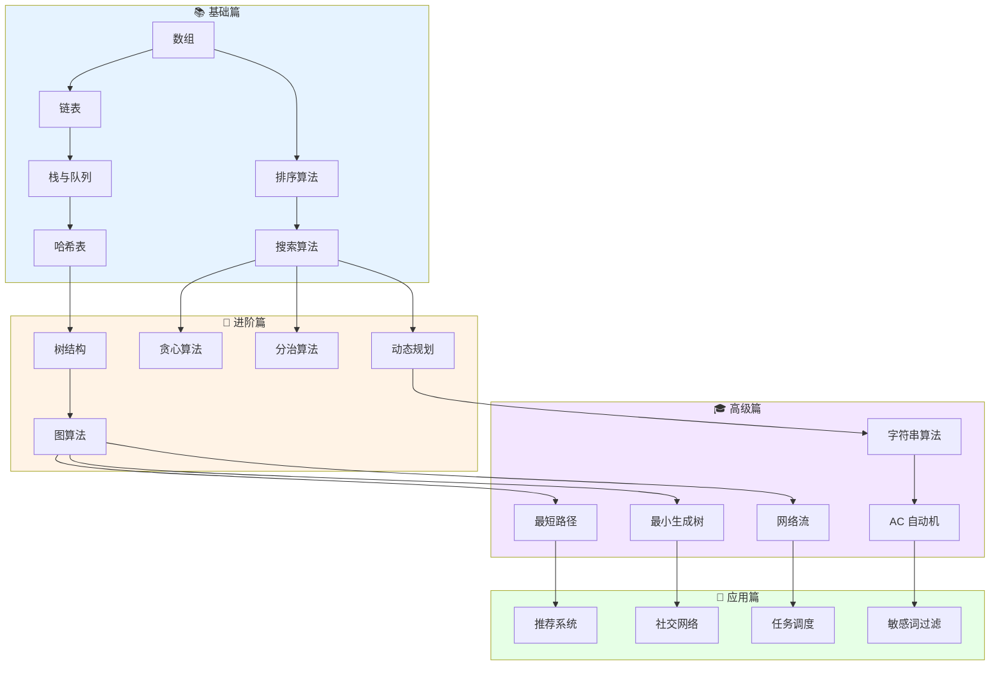
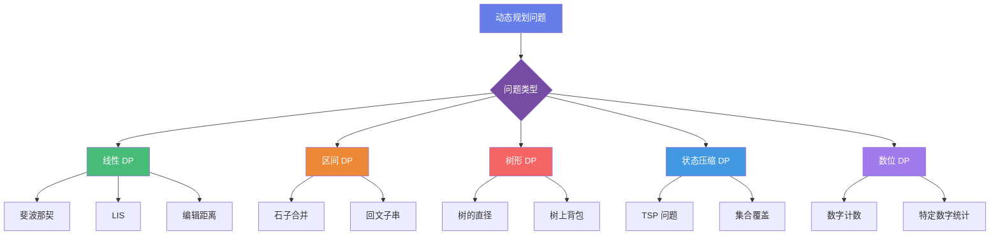
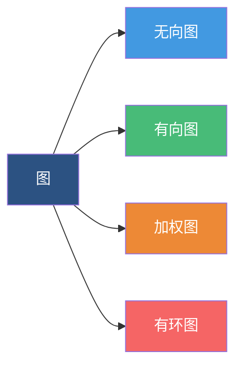
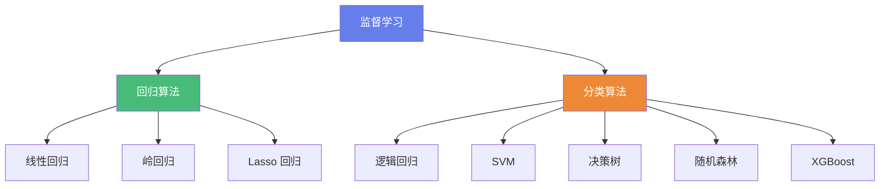
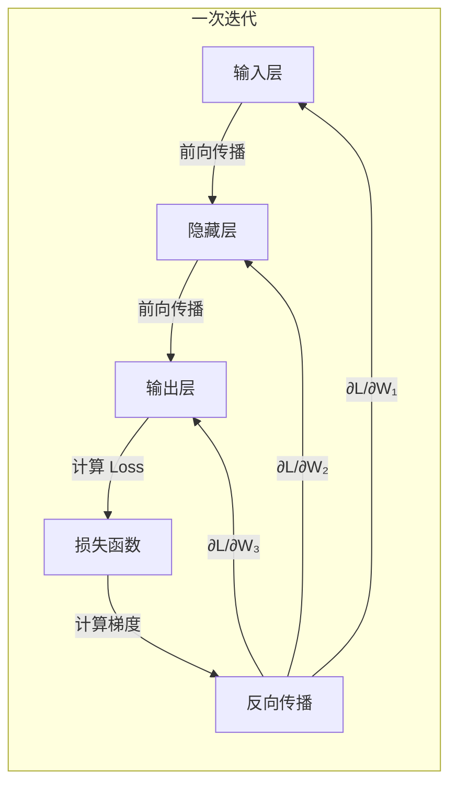

# 算法学习完全指南：从入门到 AI 大模型时代的核心技术

> 掌握编程核心技能，构建系统化算法知识体系

---

## 前言：为什么学习算法？

在计算机科学的世界里，**算法是解决问题的灵魂**。无论是日常开发中的排序搜索，还是人工智能领域的深度学习，算法思维都是程序员最核心的竞争力。

本文基于全面的算法学习平台 **AlgoGuide**，为你梳理从基础到进阶、从传统算法到 AI 大模型的完整知识体系。

---

## 一、算法知识图谱

首先，让我们通过一张图来了解算法学习的全貌：



---

## 二、十大算法思维：编程的核心能力

算法不仅仅是记住具体实现，更重要的是**理解问题本质**，**选择合适策略**，并**高效实现**。以下是编程中最常用的十种算法思维：

### 1. 🔄 递归思维

**核心公式：** `递归函数 = 终止条件 + 递归调用 + 结果合并`

将大规模问题转化为相同结构的小规模问题。核心是找到**递推关系**和**终止条件**。

**适用场景：**
- 问题可以分解为相同结构的子问题
- 树的遍历（前序、中序、后序）
- 分治算法的基础
- 动态规划的状态转移

**典型例题：** 斐波那契数列、约瑟夫环、汉诺塔、二叉树的最大深度

### 2. 📐 分治思维

**三步走：** `分解 → 解决 → 合并`

**分而治之**，将复杂问题分解为多个独立的子问题，分别求解后合并结果。

**典型例题：** 归并排序、快速排序、快速幂、求数组的逆序对

### 3. 🎯 贪心思维

**核心思想：** `局部最优 → 全局最优`

每一步都做出**局部最优选择**，期望最终得到全局最优解。

**典型例题：** 活动选择问题、霍夫曼编码、最小生成树、跳跃游戏

### 4. 📊 动态规划

**解题步骤：** `定义状态 → 状态转移 → 初始条件 → 计算顺序`

将问题分解为**重叠子问题**，保存子问题的解避免重复计算。

**适用场景：**
- 问题具有最优子结构
- 存在重叠子问题
- 计数问题、最值问题、存在性问题

**典型例题：** 背包问题、最长公共子序列、编辑距离、零钱兑换

### 5. 🔙 回溯思维

**回溯模板：** `做选择 → 递归 → 撤销选择`

**试错法**，逐步构建解决方案，发现当前路径不可行时回退到上一步重新选择。

**典型例题：** 全排列、组合总和、N 皇后、括号生成

### 6. 🪟 滑动窗口

**窗口操作：** `右边界扩张 → 满足条件 → 左边界收缩`

维护一个**窗口**在数组/字符串上滑动，可将 O(n²) 优化到 O(n)。

**典型例题：** 无重复字符的最长子串、最小覆盖子串、长度最小的子数组

### 7. 👆 双指针

**指针类型：** `左右指针 | 快慢指针 | 分离双指针`

使用两个指针在数组上移动，常用于优化暴力解法。

**典型例题：** 两数之和、三数之和、接雨水、盛最多水的容器

### 8. 🔍 二分查找

**核心思想：** 每次排除一半的搜索空间

**适用条件：** 有序数组、单调性、可二分性

**典型例题：** 搜索旋转排序数组、寻找峰值、x 的平方根

### 9. 🌲 DFS 与 BFS

**DFS：** 一条路走到黑，适合遍历、连通性判断

**BFS：** 层层推进，适合最短路径、层级遍历

### 10. 🔗 并查集

**核心操作：** `查找 (Find) + 合并 (Union)`

高效处理不相交集合的合并与查询问题。

**典型例题：** 连通分量、最小生成树、朋友圈问题

---

## 三、基础算法：排序与搜索

### 排序算法性能对比

```mermaid
graph LR
    A[排序算法] --> B[比较排序]
    A --> C[非比较排序]
    B --> B1[冒泡排序 O(n²)]
    B --> B2[快速排序 O(n log n)]
    B --> B3[归并排序 O(n log n)]
    B --> B4[堆排序 O(n log n)]
    C --> C1[计数排序 O(n+k)]
    C --> C2[桶排序 O(n+k)]
    C --> C3[基数排序 O(n×d)]
    
    style A fill:#667eea,color:#fff
    style B fill:#48bb78,color:#fff
    style C fill:#ed8936,color:#fff
```

### 六大排序算法详解

| 算法 | 最佳时间 | 平均时间 | 最坏时间 | 空间 | 稳定性 |
|------|----------|----------|----------|------|--------|
| 冒泡排序 | O(n) | O(n²) | O(n²) | O(1) | ✅ 稳定 |
| 快速排序 | O(n log n) | O(n log n) | O(n²) | O(log n) | ❌ 不稳定 |
| 归并排序 | O(n log n) | O(n log n) | O(n log n) | O(n) | ✅ 稳定 |
| 堆排序 | O(n log n) | O(n log n) | O(n log n) | O(1) | ❌ 不稳定 |
| 计数排序 | O(n+k) | O(n+k) | O(n+k) | O(k) | ✅ 稳定 |
| 桶排序 | O(n+k) | O(n+k) | O(n²) | O(n+k) | ✅ 稳定 |

### 快速排序代码示例

```javascript
function quickSort(arr, left = 0, right = arr.length - 1) {
    if (left < right) {
        const pivotIndex = partition(arr, left, right);
        quickSort(arr, left, pivotIndex - 1);
        quickSort(arr, pivotIndex + 1, right);
    }
    return arr;
}

function partition(arr, left, right) {
    const pivot = arr[right];
    let i = left - 1;

    for (let j = left; j < right; j++) {
        if (arr[j] <= pivot) {
            i++;
            [arr[i], arr[j]] = [arr[j], arr[i]];
        }
    }

    [arr[i + 1], arr[right]] = [arr[right], arr[i + 1]];
    return i + 1;
}
```

---

## 四、动态规划：从入门到精通

### 什么是动态规划？

**核心思想：** 记住过去，避免重复劳动

动态规划是一种通过将复杂问题分解为**重叠子问题**，并存储子问题的解以避免重复计算的算法设计技术。

### DP 问题类型



### 斐波那契数列：DP 入门经典

**状态转移方程：** `F(n) = F(n-1) + F(n-2)`

```python
# 方法 1: 递归（低效，存在大量重复计算）
def fib_recursive(n):
    if n <= 1:
        return n
    return fib_recursive(n - 1) + fib_recursive(n - 2)

# 方法 2: 记忆化递归（自顶向下）
def fib_memo(n, memo=None):
    if memo is None:
        memo = {}
    if n in memo:
        return memo[n]
    if n <= 1:
        return n
    memo[n] = fib_memo(n - 1, memo) + fib_memo(n - 2, memo)
    return memo[n]

# 方法 3: 动态规划（自底向上）
def fib_dp(n):
    if n <= 1:
        return n
    dp = [0, 1]
    for i in range(2, n + 1):
        dp.append(dp[i - 1] + dp[i - 2])
    return dp[n]

# 方法 4: 空间优化（只保存前两个状态）
def fib_optimized(n):
    if n <= 1:
        return n
    prev2, prev1 = 0, 1
    for i in range(2, n + 1):
        current = prev1 + prev2
        prev2, prev1 = prev1, current
    return prev1
```

| 方法 | 时间复杂度 | 空间复杂度 | 特点 |
|------|------------|------------|------|
| 递归 | O(2ⁿ) | O(n) | 大量重复计算，不推荐 |
| 记忆化递归 | O(n) | O(n) | 自顶向下，易理解 |
| 动态规划 | O(n) | O(n) | 自底向上，无递归开销 |
| 空间优化 | O(n) | O(1) | 最优解，推荐 |

### 0-1 背包问题

**状态转移方程：**
```
dp[i][w] = max(dp[i-1][w], value[i-1] + dp[i-1][w-weight[i-1]])
```

```python
# 空间优化版本 - 一维 DP
def knapsack_1d(weights, values, capacity):
    n = len(weights)
    dp = [0] * (capacity + 1)

    for i in range(n):
        # 倒序遍历，避免重复使用同一物品
        for w in range(capacity, weights[i] - 1, -1):
            dp[w] = max(dp[w], values[i] + dp[w - weights[i]])

    return dp[capacity]
```

---

## 五、图算法：解决现实世界的连接问题

### 图的分类



### 图算法分类

| 类别 | 算法 | 时间复杂度 | 应用场景 |
|------|------|------------|----------|
| **遍历** | DFS/BFS | O(V+E) | 连通性、层级遍历 |
| **最短路径** | Dijkstra | O((V+E)log V) | 非负权单源最短路径 |
| **最短路径** | Bellman-Ford | O(VE) | 可处理负权边 |
| **最短路径** | Floyd-Warshall | O(V³) | 多源最短路径 |
| **最短路径** | A*搜索 | O(b^d) | 启发式搜索 |
| **最小生成树** | Prim | O((V+E)log V) | 稠密图 |
| **最小生成树** | Kruskal | O(E log E) | 稀疏图 |
| **拓扑排序** | Kahn 算法 | O(V+E) | 任务调度 |
| **网络流** | Ford-Fulkerson | O(E×max_flow) | 最大流问题 |

### Dijkstra 算法：单源最短路径

**核心思想：** 贪心策略 —— 每次选择距离起点最近且未访问的节点

```python
import heapq

def dijkstra(graph, start):
    """
    Dijkstra 算法 - 优先队列优化版本
    graph: 邻接表，graph[u] = [(v, weight), ...]
    """
    n = len(graph)
    dist = [float('inf')] * n
    prev = [-1] * n
    dist[start] = 0

    # 优先队列：(distance, node)
    pq = [(0, start)]

    while pq:
        d, u = heapq.heappop(pq)

        if d > dist[u]:
            continue

        for v, weight in graph[u]:
            new_dist = dist[u] + weight
            if new_dist < dist[v]:
                dist[v] = new_dist
                prev[v] = u
                heapq.heappush(pq, (new_dist, v))

    return dist, prev
```

---

## 六、机器学习：AI 时代的核心算法

### 监督学习算法概览



### 线性回归

**模型假设：** `y = wx + b + ε`

**损失函数（MSE）：** `L = (1/n) Σ(yᵢ - ŷᵢ)²`

```python
import numpy as np

class LinearRegression:
    def __init__(self, learning_rate=0.01, n_iterations=1000):
        self.learning_rate = learning_rate
        self.n_iterations = n_iterations
        self.weights = None
        self.bias = None

    def fit(self, X, y):
        n_samples, n_features = X.shape
        self.weights = np.zeros(n_features)
        self.bias = 0

        for _ in range(self.n_iterations):
            y_pred = np.dot(X, self.weights) + self.bias
            dw = (1/n_samples) * np.dot(X.T, (y_pred - y))
            db = (1/n_samples) * np.sum(y_pred - y)

            self.weights -= self.learning_rate * dw
            self.bias -= self.learning_rate * db

    def predict(self, X):
        return np.dot(X, self.weights) + self.bias
```

### 逻辑回归

**Sigmoid 函数：** `σ(z) = 1 / (1 + e⁻ᶻ)`

**损失函数：** `L = -Σ[yᵢlog(ŷᵢ) + (1-yᵢ)log(1-ŷᵢ)]`

---

## 七、神经网络与 BP 反向传播

### 神经网络结构



### BP 算法核心流程

**前向传播公式：**
```
z^[l] = W^[l] · a^[l-1] + b^[l]
a^[l] = σ(z^[l])
```

**反向传播梯度计算：**
```
1. 输出层误差：δ^[L] = a^[L] - y
2. 隐藏层误差：δ^[l] = ((W^[l+1])ᵀ · δ^[l+1]) ⊙ σ'(z^[l])
3. 权重梯度：∂L/∂W^[l] = δ^[l] · (a^[l-1])ᵀ / m
4. 更新权重：W^[l] = W^[l] - α · ∂L/∂W^[l]
```

### 激活函数对比

| 激活函数 | 公式 | 输出范围 | 特点 |
|----------|------|----------|------|
| Sigmoid | `1/(1+e⁻ᶻ)` | (0,1) | 适合二分类，梯度消失 |
| ReLU | `max(0,z)` | [0,+∞) | 最常用，计算简单 |
| Tanh | `(eᶻ-e⁻ᶻ)/(eᶻ+e⁻ᶻ)` | (-1,1) | 零中心化 |
| Softmax | `eᶻⁱ/Σⱼeᶻʲ` | (0,1) | 多分类输出层 |

---

## 八、AI 大模型时代的核心算法

### 1. 向量嵌入 (Embedding)

将离散符号映射到连续向量空间，是大模型理解语义的基础。

**代表技术：**
- Word2Vec：词向量表示
- GloVe：全局词向量
- BERT：上下文相关嵌入

### 2. 近似最近邻搜索 (ANN)

高效向量检索技术，支撑向量数据库和 RAG 应用。

**主流算法：**
- LSH：局部敏感哈希
- HNSW：分层可导航小世界
- FAISS：Facebook AI 相似性搜索

### 3. 文本分块 (Text Chunking)

RAG 预处理技术，将长文本分割为适合处理的片段。

**分块策略：**
- 句子分割
- 语义分块
- 递归分块

---

## 九、分布式系统与大数据算法

### 共识算法

| 算法 | 类型 | 特点 | 应用场景 |
|------|------|------|----------|
| Paxos | 强一致 | 理论完备，实现复杂 | 分布式存储 |
| Raft | 强一致 | 易于理解实现 | etcd、Consul |
| PBFT | 强一致 | 拜占庭容错 | 联盟链 |
| PoW | 概率一致 | 工作量证明 | 比特币 |
| PoS | 概率一致 | 权益证明 | 以太坊 2.0 |

### 概率算法

**HyperLogLog：** 12KB 内存估计 2^64 个元素的基数

**PageRank：** Google 核心算法，网页重要性评估

---

## 十、学习路径建议


### 阶段一：基础夯实（1-2 个月）

1. 掌握基本数据结构：数组、链表、栈、队列、哈希表
2. 学习基础算法：排序、搜索、递归
3. 理解时间/空间复杂度分析

### 阶段二：算法思维（2-3 个月）

1. 深入学习十大算法思维
2. 刷 LeetCode 简单/中等题 100+
3. 掌握动态规划、贪心、回溯等核心思维

### 阶段三：进阶提升（3-4 个月）

1. 图算法详解：最短路径、最小生成树
2. 字符串算法：KMP、Trie、AC 自动机
3. 刷 LeetCode 中等/困难题 200+

### 阶段四：机器学习（3-4 个月）

1. 监督学习：线性回归、逻辑回归、SVM、决策树
2. 无监督学习：K-Means、PCA、聚类
3. 神经网络与 BP 算法

### 阶段五：AI 大模型（持续学习）

1. Embedding 技术
2. Transformer 架构
3. 向量检索与 RAG
4. 大模型应用开发

---

## 结语：算法学习的本质

算法学习不是死记硬背，而是培养**问题拆解能力**和**抽象思维能力**。每一道算法题背后，都蕴含着一种解决问题的思维方式。

**记住：**
- 🎯 理解比记忆更重要
- 🔄 实践是最好的老师
- 📈 持续学习，与时俱进
- 💡 算法思维可以迁移到任何领域

在 AI 大模型时代，算法基础依然是程序员的核心竞争力。掌握算法，就是掌握了解决复杂问题的钥匙。

---

> **参考资料：** 本文内容基于 AlgoGuide 算法学习平台整理，涵盖从基础算法到 AI 大模型的完整知识体系。更多详细教程和交互演示，欢迎访问原站学习。

*本文约 5000 字，建议收藏后慢慢阅读。如有疑问，欢迎在评论区交流讨论。*
